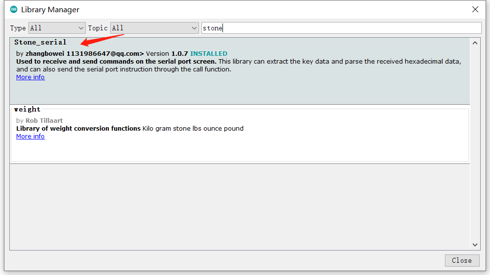

# arduino_lib

This library is specially used for STONE serial screen communication with arduino

Below is an API and example for instruction sending in the header file stone.h

//Send function********************************************
void STONE_JSON (char* name, char* value, ...);
void tx_create (void);

/* command interface for setting the system-related commands */
// Call the example: set_sys("sys_reboot");
void set_sys(char* m_cmd);

/* Command interface for the command to set the screen backlight */
// Call the example: set_sleep("true");
void set_sleep(char* m_tf);

/* Command interface for setting the buzzer time,In milliseconds */
// Call the example: set_buzzer("100");
void set_buzzer(char* _time);

//#define set_brightness(_value) set_buzzer(_value)
/* Command interface for setting backlight brightness, The value ranges from 0 to 100*/
// Call the example: set_brightness("100");
void set_brightness(char* _value);

/* Command interface for setting Touch screen calibration (for resistive screens) */
// Call the example: set_touch_cal();
void set_touch_cal(void);

/* Command interface for remove Touch screen calibration (for resistive screens) */
// Call the example: clear_touch_cal();
void clear_touch_cal(void);

/* Command interface for Touch screen test */
// Call the example: set_touch_test();
void set_touch_test(void);

/* Command interface for the command to set the enable state of the widget */
// Call the example: set_enable("switch1", "false");
void set_enable(char* m_name, char* m_tf, ...);

/* Command interface for the command to set the visible state of the widget */ 
// Call the example: set_visible("switch1", "false");
#define set_visible(m_name, m_tf) set_enable(m_name, m_tf, 1)
/* Command interface for the command to set the coordinate position of the widget */
// Call the example: set_coordinate("switch1", "100", "200");
void set_coordinate(char* _name, char* _x, char* _y);

/* Command interface for the command Control state */
// Call the example: set_state("button1", "pressed");
void set_state(char* _name, char* _state);

/* Command interface for the Set the background image */
// Call the example: set_bg_image("button1", "guage_bg");
void set_bg_image(char* _name, char* _image);

/* Command interface for the Set the background color */
// Call the example: set_color("button1", "bg_color", "guage_bg");
void set_color(char* _name, char* _object, char* _color);

/* Command interface for the command to open a window */
// Call the example: open_win("window2");
void open_win(char* _name, ...);

/* Command interface for the command to close the window */
// Call the example: close_win("window1");
#define close_win(m_name) open_win(m_name, 1)
/* Command interface to return to the previous level of window */
// Call the example: back_win();
void back_win(void);

/* Return to the command interface of the specified window */
// Call the example: back_win_to("window1");
#define back_win_to(m_name) open_win(m_name, 2)
/* Command interface for returning the main window command */
// Call the example: back_home();
void back_home(void);

/* command interface for Setting the text commands */
// Call the example: set_text("label", "label5", "hello stone");
void set_text(char* _type, char* _name, char* _text);

/* Command interface for the set value command */
// Call the example: set_value("slider", "slider2", "66");
// Call the example:  set_value("label", "label5", "66.6", "%.2f");
void set_value(char* _type, char* _name, char* _value, ...);

/* Command interface for getting text commands */
// Call the example: get_text("edit", "edit1");
void get_text(char* _type, char* _name);

/* Command interface for the Get Value command */
// Call the example: get_value("edit", "edit2");
void get_value(char* _type, char* _name);

/* Command interface for the set maximum command */
// Call the example: set_max("slider", "slider2", "500");
void set_max(char* _type, char* _name, char* value);

/* Command interface for displaying text commands */
// Call the example: show_text("progress_bar1", "true");
void show_text(char* _name, char* _tf);

/* Command interface for the Get Progress Bar Percentage command */
// Call the example: get_percent("progress_bar1");
void get_percent(char* _name);

/* Command interface for the set minimum command */
// Call the example: set_min("slider", "slider2", "1");
void set_min(char* _type, char* _name, char* value);

/* Command interface for setting slider step value command */
// Call the example: set_step("slider1", "1");
void set_step(char* _name, char* value);

/* Command interface for setting the picture animation playback command */
// Call the example: set_play("image_animation1");
void set_play(char* _name,...);

/* Command interface for setting the pause command for picture animation playback */
// Call the example: set_pause("image_animation1");
#define set_pause(m_name) set_play(m_name,1)
/* Command interface for setting the picture animation stop command */
//// Call the example: set_stop("image_animation1");
#define set_stop(m_name)   set_play(m_name,2)
/* Command interface for setting format commands */
// Call the example: set_format("image_value", "iamge_value1", "%02.2f");
void set_format(char* _type, char* _name, char* _format);

/* Command interface for setting picture commands */
// Call the example: set_image("image_value", "iamge_value1", "light_on");
void set_image(char* _type, char* _name, char* _image);

/* Command interface for the set picture animation interval command */
// Call the example: set_interval("image_animation1", "100");
void set_interval(char* _name, char* _interval);

/* Command interface for setting the loop command */
// Call the example: set_loop("image_animation1", "true");
void set_loop(char* _name, char* _tf);

/* Command interface for setting range commands */
// Call the example: set_range("image_animation1", "1" , "10");
void set_range(char* _name, char* start, char* end);

/* Command interface for the set picture display method command */
// Call the example: set_draw_type("image", "image1" , "2");
void set_draw_type(char* _type, char* _name, char* draw_type);

/* Command interface for the set image scaling command */
// Call the example: set_scale("image2", "0.5" , "1");
void set_scale(char* _name, char* _x, char* _y);

/* Command interface for the set picture rotation angle command */
// Call the example: set_rotation("image1", "180");
void set_rotation(char* _name, char* _rotation);

/* Command interface for setting the current selector command of the text selector */
// Call the example: set_selected("text_selector","text_selector1", "20");
// Call the example: set_selected("combo_box_ex","combo_box_ex1", "6");
void set_selected(char* _type, char* _name, char* _selected);

/* Command interface to get the current selector command of the text selector */
// Call the example: get_selected("text_selector","text_selector1");
// Call the example: get_selected("combo_box_ex","combo_box_ex1");
void get_selected(char* _type, char* _name);

/* Command interface for the set date command */
// Call the example: set_date("2022-02-22 22:22:22");
void set_date(char* _name, char* _date);

/* Command interface for the get date command */
// Call the example: get_date("clock1");
void get_date(char* _name);

/* Command interface for the get checked command */
// Call the example: get_checked("check1");
void get_checked(char* _name);

/* Command interface for the set angle command */
// Call the example: set_angle("pointer1", "10");
void set_angle(char* _name, char* _angle);

/* Command interface for the set the curve sequence point data */
// Call the example: chart_set_value_index("line_series", "line_series1", "1", "100");
// Call the example: chart_set_value_index("line_series", "line_series1", "1", "[10,29,69,45,67,34]");
void chart_set_value_index(char* _type, char* _widget, char* _index, char* _value);

/* Command interface for the set the curve sequence point data
The sequence point is set to multiple values in the way of push, 
that is, the data is appended to the end and the previous data is moved forward*/
// Call the example: chart_set_value_push("line_series", "line_series1", "23");
// Call the example: chart_set_value_push("line_series", "line_series1", "[10,29,69,45,67,34]");
void chart_set_value_push(char* _type, char* _widget, char* _value);

/* Command interface for the ets whether the curve sequence boundary is displayed and smooth (line_series only) */
// Call the example: chart_set_line("line_series", "line_series1", "true", "false");
void chart_set_line(char* _type, char* _widget, char* _show, char* _smooth);

/* Command interface for the sets whether the curve sequence boundary is displayed and smooth (line_series only) */
// Call the example: chart_set_area("line_series", "line_series1", "true");
void chart_set_area(char* _type, char* _widget, char* _show);

/* Command interface for the sets whether the curve sequence point marker is displayed (line_series only) */
// Call the example: chart_set_symbol("line_series", "line_series1", "true");
void chart_set_symbol(char* _type, char* _widget, char* _show);

/* Command interface for the set the FIFO capacity of curve sequence points */
// Call the example: chart_set_capacity("line_series", "line_series1", "15");
void chart_set_capacity(char* _type, char* _widget, char* _value);

/* Command interface for the obtain the point data of curve sequence */
// Call the example: chart_get_value("line_series", "line_series1", "4");
void chart_get_value(char* _type, char* _widget, char* _index);

/* Command interface for the gets the cancel sequence point FIFO capacity */
// Call the example: chart_get_capacity("line_series", "line_series1");
void chart_get_capacity(char* _type, char* _widget);
